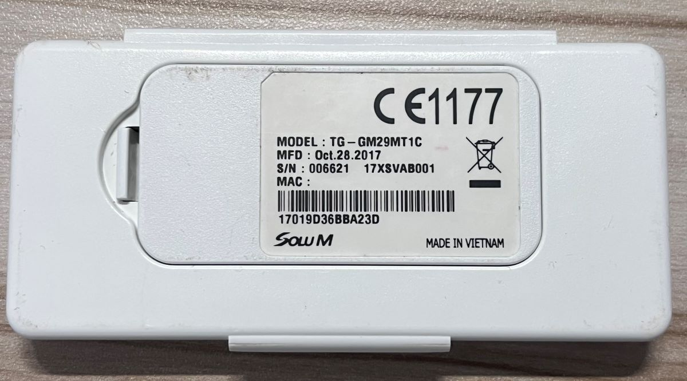
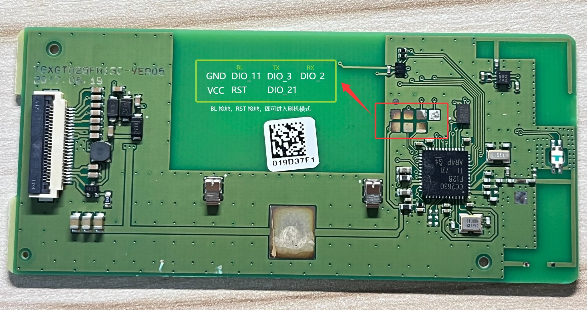

# Tag_FW_CC26xx

[OpenEPaperLink](https://github.com/OpenEPaperLink/OpenEPaperLink) firmware for CC26xx based tags.

## Supported Chip / Tags

- CC2630: `TG‐GM29MT1C` / `ST‐GM29MTF` (sleep current: `~2uA`)

### Specs

* TI [CC2630](https://www.ti.com/product/CC2630) ARM Cortex-M3 core, 128KB flash, 8KB SRAM, 20KB Ultra Low-Leakage SRAM, 24MHZ clock*,  802.15.4 2.4Ghz radio
* 2.9” ePaper display (`UC8151` or `SSD1680`)
* SPI EEPROM (1M, W25Q80)
* [Dedicated wake-IC](https://twitter.com/atc1441/status/1388252497316392963)
* NXP NFC controller (I2C)
* 2x CR2450 Coin cell

ST-GM29MTF uses the same PCB as TG-GM29MT1C, but without the LED and NFC chip (not soldered).

### Photos

### SoC and Debug pinouts

To program or read-out this tag you have two options:

- Connect BL pin to GND and power on (or reset if already powered on) to enter bootloader mode, then use [cc2538-bsl](https://github.com/JelmerT/cc2538-bsl) to flash firmware via UART.
- cJTAG or JTAG programmer (J-Link or TI's XDS110), you need to solder the debug pins from the SOC, which is pretty hard for most people.

## Develop

- Install [toolchain](https://armkeil.blob.core.windows.net/developer/Files/downloads/gnu-rm/9-2020q2/gcc-arm-none-eabi-9-2020-q2-update-win32.exe)
- Build: `make`
- Flash: `make flash PORT=COM3`

## License

[Creative Commons Attribution-NonCommercial-ShareAlike 4.0 International (CC BY-NC-SA 4.0)](https://creativecommons.org/licenses/by-nc-sa/4.0/)
